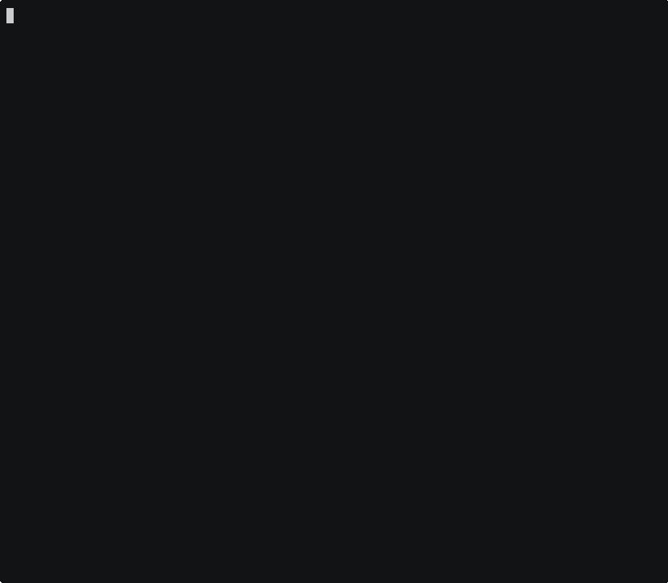

# Re:Earth Serve

Spatial Data Delivery — an asset hosting and tile delivery service built on Cloudflare Workers + R2 + D1.



## ✨ Features

- ⚡ **CLI First** — Run `upload myfile.geojson` and instantly get a public URL. No authentication required in demo mode. Both CLI and API are available, making it easy to integrate with CI/CD pipelines and AI agents.
- 🔄 **Asset Versioning** — Upload new content to an existing asset without changing its ID or URL. Each version is immutable; set an active version or default to the latest. Rollback by switching the active version.
- 📦 **Archive Extraction** — ZIP/tar/tar.gz uploads are automatically extracted and served as individual files. Supports multi-GB archives, checkpoint-based resume, and root folder auto-stripping.
- 📡 **HTTP Range Requests** — Full support for `Range` headers (HTTP 206), enabling partial file reads. Works with PMTiles, Cloud-Optimized GeoTIFF (COG), and other formats that rely on byte-range access — no full download needed.
- 🚀 **Presigned URL Uploads** — Large files (>100MB) bypass the Worker body size limit via presigned URLs for direct-to-R2 uploads with automatic multipart splitting.
- 🗜️ **Gzip Compression** — The CLI compresses compressible files (JSON, GeoJSON, CSV, 3D Tiles, glTF, MVT, etc.) locally before upload. The extension list is generated from [`jshttp/mime-db`](https://github.com/jshttp/mime-db) plus domain extras in `scripts/compressible-extras.json` (run `npm run gen:compressible` to regenerate). On download, gzip-stored files are decompressed on-the-fly. Range requests on compressed files are also supported.
- 🔐 **Authentication & RBAC** — JWT-based authentication via any OIDC-compliant IdP, with workspace-scoped role-based access control (owner/admin/editor/viewer). Optional Cerbos PDP integration for policy-based authorization.

## Quick Start

```bash
npm install
npm run dev        # Start dev server (React Router + Cloudflare Workers)
```

### Upload a file (CLI)

```bash
npm run cli -- upload myfile.geojson
# → http://localhost:5173/files/abc123/myfile.geojson
```

### Upload a file (API)

```bash
curl -X POST http://localhost:5173/api/v1/assets \
  -H "Content-Type: application/geo+json" \
  -H "X-Filename: myfile.geojson" \
  -H "Content-Length: $(wc -c < myfile.geojson)" \
  --data-binary @myfile.geojson
```

When calling with `Authorization: Bearer <jwt>`, add
`X-Project-Id: <projectId>` — authenticated uploads must be project-scoped
and the caller must be a member of the project's workspace. Anonymous
(demo-mode) uploads omit both headers and are tracked by `X-Session-Id`.

## Architecture

| Component | Technology |
|-----------|-----------|
| Runtime | Cloudflare Workers |
| Storage | Cloudflare R2 (zero egress) |
| Metadata | Cloudflare D1 (SQLite) |
| Sessions | Cloudflare KV (TTL auto-expiry) |
| Queues | Cloudflare Queues (extraction, webhooks) |
| Containers | Cloudflare Containers (Go) |
| API | Hono |
| UI | React Router (SSR) + Tailwind CSS |
| CLI | Commander.js + tsx |

### Project Structure

| Directory | Description |
|-----------|-------------|
| `worker/` | Cloudflare Worker (Hono routes, domain logic, infra adapters) |
| `worker/infra/` | Infrastructure layer (D1, KV, R2, container adapters) |
| `worker/infra/migrations/` | D1 schema migrations |
| `shared/` | Shared types (Zod schemas) and API path constants |
| `app/` | React Router frontend |
| `cli/` | CLI client (Commander.js) |
| `container/archive-extractor/` | Archive extraction container (Go) — ZIP/tar/tar.gz → R2 |
| `e2e/` | E2E tests |
| `docs/adr/` | Architecture Decision Records |

### Storage Design

| Store | Backend | Entities | Rationale |
|-------|---------|----------|-----------|
| D1 | SQLite | Assets, Jobs, Projects, Workspaces, Members, Storage Usage | Strong consistency, atomic operations, relational queries |
| KV | Key-Value | Sessions, Upload Sessions | TTL auto-expiration for ephemeral data |
| R2 | Object Storage | File content | Zero egress cost, Range request support |

See [ADR-003](./docs/adr/003-kv-to-d1-migration.md) for the D1 migration rationale, [ADR-005](./docs/adr/005-asset-versioning.md) for asset versioning, [ADR-006](./docs/adr/006-derived-asset-and-asset-edge.md) for derived assets and dependency graphs, and [ADR-007](./docs/adr/007-webhooks-and-event-log.md) for webhooks and event logging.

## API

### Public API (`/api/v1`)

| Method | Path | Description |
|--------|------|-------------|
| `GET` | `/api/v1/health` | Health check |
| `POST` | `/api/v1/assets` | Upload a file (streaming) |
| `GET` | `/api/v1/assets` | List assets (`?limit=&cursor=`) |
| `GET` | `/api/v1/assets/:id` | Get asset metadata (includes `currentVersion`, `versionCount`) |
| `PATCH` | `/api/v1/assets/:id` | Update asset (`description`, `userMeta`, `activeVersionId`) |
| `POST` | `/api/v1/assets/:id` | Upload new version to existing asset |
| `GET` | `/api/v1/assets/:id/versions` | List versions (newest first, paginated) |
| `GET` | `/api/v1/assets/:id/versions/:vid` | Get version metadata |
| `PATCH` | `/api/v1/assets/:id/versions/:vid` | Update version (`userMeta`) |
| `DELETE` | `/api/v1/assets/:id/versions/:vid` | Delete a specific version |
| `PUT` | `/api/v1/assets/:id/active-version` | Set active version (`{ versionId }` or `null` for latest) |
| `GET` | `/api/v1/assets/:id/files` | List files (NDJSON stream, `?prefix=` filter) |
| `DELETE` | `/api/v1/assets/:id` | Delete asset and all versions |
| `POST` | `/api/v1/assets/uploads` | Create presigned upload session |
| `POST` | `/api/v1/assets/uploads/:id/complete` | Complete upload session |
| `POST` | `/api/v1/assets/:id/extract` | Start archive extraction |
| `GET` | `/api/v1/jobs` | List jobs (`?limit=&cursor=`) |
| `GET` | `/api/v1/jobs/:id` | Get extraction job status |
| `POST` | `/api/v1/jobs/:id/retry` | Retry a failed extraction job |
| `GET` | `/api/v1/me` | Get current user info + workspace list |
| `GET` | `/api/v1/projects` | List projects (`?workspaceId=` filter) |
| `POST` | `/api/v1/projects` | Create project |
| `GET` | `/api/v1/projects/:id` | Get project |
| `DELETE` | `/api/v1/projects/:id` | Delete project |
| `POST` | `/api/v1/workspaces` | Create workspace |
| `GET` | `/api/v1/workspaces/:id` | Get workspace |
| `DELETE` | `/api/v1/workspaces/:id` | Delete workspace |
| `GET` | `/api/v1/workspaces/:id/members` | List workspace members |
| `POST` | `/api/v1/workspaces/:id/members` | Add member |
| `PATCH` | `/api/v1/workspaces/:id/members/:userId` | Update member role |
| `DELETE` | `/api/v1/workspaces/:id/members/:userId` | Remove member |
| `GET` | `/api/v1/doc` | OpenAPI 3.1 JSON spec |
| `GET` | `/api/v1/docs` | Scalar interactive API reference |

### Internal API (`/api/internal`)

| Method | Path | Description |
|--------|------|-------------|
| `POST` | `/api/internal/jobs/:id/status` | Container → Worker job status update |
| `GET` | `/api/internal/assets/:id/exists` | Container → Worker asset existence check |

These endpoints require `Authorization: Bearer $INTERNAL_API_SECRET` — set it via `wrangler secret put INTERNAL_API_SECRET` in production. Without the secret configured the Worker rejects every internal-API request and the extraction container will not be launched.

### File Delivery

| Method | Path | Description |
|--------|------|-------------|
| `GET` | `/files/:id/:filename` | Download file (CORS `*`, Range support) |
| `GET` | `/files/:id/:filename/*` | Download extracted archive file |

Assets support **versioning** — uploading to an existing asset (`POST /api/v1/assets/:id`) creates a new version while keeping the asset ID and URL stable. Each asset can have an explicit active version; if unset, the latest version is served. File URLs (`/files/:id/:filename`) resolve the active/latest version automatically. Version IDs can also be used directly in file URLs. Demo mode assets (no project) auto-expire after 1 hour. Project assets are permanent. See [ADR-005](./docs/adr/005-asset-versioning.md).

## CLI

The CLI (`npm run cli --`) provides subcommands for managing assets and files. Set `REEARTH_SERVE_ENDPOINT` to change the target server (default: `http://localhost:8787`).

```bash
# Upload
npm run cli -- upload myfile.geojson
npm run cli -- upload --direct myfile.geojson   # skip presigned URLs

# Asset management
npm run cli -- asset list
npm run cli -- asset list --limit 50 --cursor <cursor>
npm run cli -- asset show <id>
npm run cli -- asset update <id> --description "My dataset" --user-meta '{"tag":"v1"}'
npm run cli -- asset delete <id>

# Versioning
npm run cli -- asset upload <id> ./updated-data.geojson   # upload new version
npm run cli -- asset versions <id>                        # list versions
npm run cli -- asset version list <id>                    # alias for above
npm run cli -- asset version show <id> <vid>              # version details
npm run cli -- asset version update <id> <vid> --user-meta '{"note":"fixed"}'
npm run cli -- asset version delete <id> <vid>            # delete specific version
npm run cli -- asset set-version <id> --vid <vid>         # set active version
npm run cli -- asset set-version <id> --latest            # reset to latest

# File operations
npm run cli -- file ls <id>                     # list files
npm run cli -- file ls -l <id> tiles/           # detailed list with prefix filter
npm run cli -- file cp <id>:tileset.json .       # download single file
npm run cli -- file cp -r <id>:tiles/ ./out     # recursive download
npm run cli -- file cp -rf <id>:tiles/ ./out    # recursive + overwrite
npm run cli -- file sync <id> ./local           # hash-based diff sync
npm run cli -- file sync --delete <id> ./local  # sync + remove extra local files

# Job management
npm run cli -- job list
npm run cli -- job show <id>
npm run cli -- job retry <id>

# Project management
npm run cli -- project list
npm run cli -- project create <name>
npm run cli -- project show <id>
npm run cli -- project delete <id>
npm run cli -- project use <id>                 # set default project

# Workspace management
npm run cli -- workspace list
npm run cli -- workspace create <name>
npm run cli -- workspace show <id>
npm run cli -- workspace delete <id>
npm run cli -- workspace use <id>               # set default workspace
npm run cli -- workspace member list
npm run cli -- workspace member add <userId> --role editor
npm run cli -- workspace member update <userId> --role admin
npm run cli -- workspace member remove <userId>

# Authentication
npm run cli -- login --issuer <url> --client-id <id>
npm run cli -- whoami
npm run cli -- logout

# Global options
npm run cli -- --endpoint https://example.com upload myfile.geojson
npm run cli -- --json asset show <id>           # JSON output
```

`file sync` uses MD5 hash comparison (matching R2 ETags) to skip unchanged files. When no hash is available, it falls back to size comparison.

## Roadmap

See [ROADMAP.md](./ROADMAP.md) for the full development roadmap.

## Contributing

See [CONTRIBUTING.md](./CONTRIBUTING.md) for development setup, scripts, deployment, testing, and database migrations.
