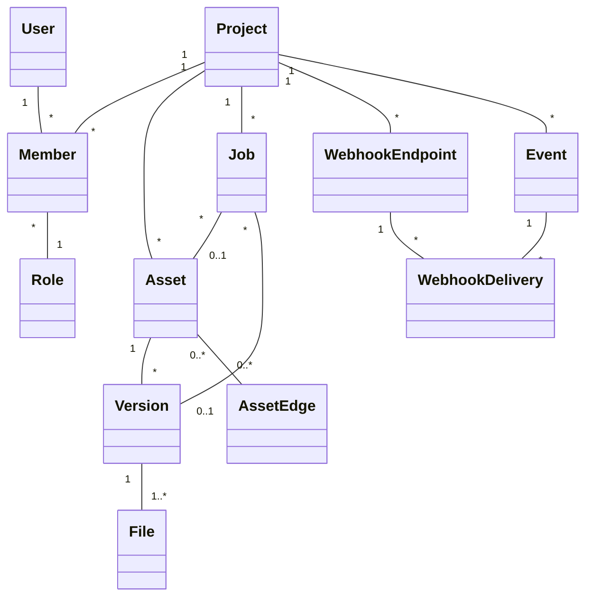

# Re:Earth Serve — Roadmap

> **Spatial Data Delivery Layer for the Re:Earth Ecosystem**
>
> Re:Earth Serve delivers processed spatial data under the correct security model, cleanly separating static file hosting (file-layer access control) from tile services (service-layer access control).

---

## Target Users

Based on the [product proposal](./PLAN.md), Re:Earth Serve targets two distinct user groups with tailored interfaces:

### Primary Segments

| Priority | Segment | Examples | Key Needs |
|----------|---------|----------|-----------|
| **Highest** | Government & municipal DX | PLATEAU projects, smart city initiatives, urban planning | Security accountability, procurement compliance, Re:Earth ecosystem integration |
| **High** | GIS SaaS & geospatial startups | Re:Earth Visualizer users, Mapbox alternative seekers | Cost efficiency, flexible integration, Japanese-language support |
| **Medium** | Enterprise (construction, infrastructure, real estate) | Large companies with internal spatial data delivery needs | Large-scale operations, security requirements, SLA |
| **Supplementary** | Research & academic institutions | Geospatial data sharing and publication | Low cost, open data integration |

### Two Interfaces: Web UI + CLI/API

Re:Earth Serve provides two parallel interfaces to serve both non-engineers and engineers:

| Interface | Target Users | Use Cases |
|-----------|-------------|-----------|
| **Web UI** | Non-engineers, GIS analysts, municipal staff, project managers | Asset management, tileset configuration, visual preview, project settings — no coding required |
| **CLI / API** | GIS engineers, plugin developers, CI/CD pipelines, AI agents | Automation, scripting, bulk operations, integration with Re:Earth Flow and external systems |

Both interfaces share the same underlying API. The Web UI is built on React Router (SSR) and will be developed after the API stabilizes (Phase 2+). The CLI is available from Phase 0.

---

## System Architecture: serve + untiled

Re:Earth's spatial data delivery is split into two independent systems with a clear responsibility boundary:

### Re:Earth Serve — Asset Lifecycle & Delivery

Serve is the **storage, versioning, and delivery** layer. It manages assets, their versions, dependency graphs, access control, webhooks, and event logging. It serves files directly to end users.

**Serve owns:**
- Asset CRUD, versioning, and file storage (R2)
- Dependency graph (Asset Edges) and dirty propagation
- Status state machine (dirty → pending → ready/failed)
- Access control (authentication, authorization, project/workspace scoping)
- Webhook subscriptions, event log, and event delivery
- Archive extraction (zip/tar → files within the same asset version)
- Storage usage tracking
- File serving (`/files/:id/:filename`) with version resolution

**Serve does NOT do:**
- Format conversion (GeoJSON → FGB, GeoTIFF → COG, etc.)
- Tile rendering or generation
- Tile caching
- Any GDAL / tippecanoe / py3dtiles processing

### Re:Earth Untiled — Tile Processing & Rendering

untiled is the **transformation and tile serving** engine. It subscribes to serve's webhook events, performs format conversions and tile generation, uploads results back to serve, and serves tile requests with its own caching layer.

**untiled owns:**
- On-demand tile rendering (COG, pre-tiled sources, terrain, compositing)
- Format conversion (GeoJSON → FGB, GeoTIFF → COG, CityGML → 3D Tiles, etc.)
- Vector tile generation (tippecanoe)
- 3D Tiles generation (py3dtiles, citygml-tools)
- Tile response caching (KV/CDN, managed independently of serve)
- MapLibre Style JSON rendering
- External tile service proxy & cache
- Terrain tile composition (geoid–ellipsoid height)

**Integration pattern:**
1. User uploads source data to serve → serve emits `asset.version.created` webhook
2. untiled receives webhook → picks up transformation job via serve's status API
3. untiled transitions status: `dirty → pending` (optimistic lock)
4. untiled processes data (GDAL, tippecanoe, etc.)
5. untiled uploads result to serve as a new DerivedAsset version
6. untiled transitions status: `pending → ready`
7. untiled purges its tile cache if needed
8. serve emits `asset.version.ready` webhook → downstream consumers notified

```
┌─────────────────────────────────────────────────┐
│                  Re:Earth Serve                  │
│                                                  │
│  Assets ─→ Versions ─→ Files (R2)               │
│    │                                             │
│    ├── Asset Edges (DAG)                         │
│    ├── Status State Machine                      │
│    ├── Webhooks & Event Log                      │
│    ├── Access Control                            │
│    └── File Serving (/files/:id/:filename)       │
│                                                  │
│  webhook ↓ events          ↑ upload results      │
└──────────┬─────────────────┴─────────────────────┘
           │                 │
┌──────────▼─────────────────┴─────────────────────┐
│                 Re:Earth Untiled                  │
│                                                  │
│  Format Conversion (GDAL, tippecanoe, ...)       │
│  On-Demand Tile Rendering                        │
│  Tile Cache (KV/CDN — serve is unaware)          │
│  Tile Serving (/{z}/{x}/{y}.{format})            │
└──────────────────────────────────────────────────┘
```

### Why Separate?

| Concern | Benefit of Separation |
|---------|----------------------|
| **Scaling** | Serve scales at the edge (Workers, 300+ locations). untiled scales compute (Containers, GPU). Different resource profiles. |
| **Deployment** | Serve can deploy independently of untiled. Tile rendering changes don't affect file delivery. |
| **Failure isolation** | A GDAL crash in untiled doesn't affect file serving in serve. |
| **Evolution** | Tile formats and processing tools change rapidly. Storage and access control are stable. Separate repos evolve at different speeds. |
| **Testing** | Serve can be fully tested without GDAL/tippecanoe. untiled can be tested with mock assets. |

---

## Architecture Overview

- **Runtime**: Cloudflare Workers
- **Object Storage**: Cloudflare R2 (egress-free)
- **Metadata Store**: Cloudflare D1 (SQLite)
- **Session/Cache Store**: Cloudflare KV
- **Queues**: Cloudflare Queues (webhook delivery, archive extraction)
- **Containers**: Cloudflare Containers (archive extraction via Go)
- **Framework**: Hono (lightweight HTTP framework for Workers)

### Why Cloudflare?

| Advantage | Detail |
|-----------|--------|
| **Zero egress cost** | R2 has no bandwidth charges — potentially 100× cheaper than traditional cloud for tile delivery |
| **Edge computing** | Workers run in 300+ locations worldwide, minimizing latency |
| **Region hints** | R2 and Workers can be pinned to specific jurisdictions (data sovereignty) |
| **Integrated stack** | R2 + KV + D1 + Queues + Containers + Cron Triggers cover all infrastructure needs |

---

## Serve Phases

### Phase 0 — MVP: Ephemeral Asset Hosting (API + CLI) ✅

Minimal viable file delivery service. No UI, no auth, no tile processing.

#### Capabilities

- [x] **Upload**: `POST /api/v1/assets` — upload a file (raw body streaming), receive a public URL
- [x] **Download**: `GET /files/:id/:filename` — serve the file with correct `Content-Type`, `Content-Encoding`, and `Range` request support (HTTP 206)
- [x] **Delete**: `DELETE /api/v1/assets/:id` — remove an asset immediately
- [x] **Immutable assets**: once uploaded, an asset cannot be overwritten — upload or delete only
- [x] **Auto-expiration**: assets expire after 1 hour; a scheduled worker cleans up R2 objects
- [x] **CORS**: `Access-Control-Allow-Origin: *` on all asset responses
- [x] **CLI**: `reearth-serve <file>` uploads the file and prints the public URL
- [x] **Presigned URL upload**: `POST /api/v1/assets/uploads` creates a presigned upload session; supports S3 multipart for large files (>100MB)
- [x] **Gzip compression**: compression is the uploader's responsibility — CLI compresses compressible files locally; server stores as-is and decompresses on download when needed

#### Data Model (KV)

```
Key:   asset:{id}
Value: { id, filename, contentType, size, createdAt, expiresAt }
TTL:   3600s (auto-expire)
```

#### API Summary

| Method | Path | Description |
|--------|------|-------------|
| `POST` | `/api/v1/assets` | Upload a file (raw body streaming) |
| `GET` | `/api/v1/assets/:id` | Get asset metadata |
| `DELETE` | `/api/v1/assets/:id` | Delete an asset |
| `POST` | `/api/v1/assets/uploads` | Create presigned upload session |
| `POST` | `/api/v1/assets/uploads/:id/complete` | Complete upload session |
| `GET` | `/files/:id/:filename` | Download file (CORS `*`, Range support) |
| `GET` | `/api/v1/health` | Health check |

---

### Phase 1 — Zip Upload & Static Site Hosting ✅

Upload a `.zip` archive; the server extracts it and serves the contents as a directory.

- [x] Zip extraction via Cloudflare Containers or in-worker decompression
- [x] Directory listing or index file resolution (`index.html`)
- [x] Enables uploading pre-built tile packages (XYZ directory structure, 3D Tiles tileset, etc.)

---

### Phase 2 — Authentication, Projects & Asset Management ✅

Introduce user identity, project scoping, and persistent assets.

- [x] **Auth**: API key or OAuth (Re:Earth Dashboard integration)
- [x] **Projects**: logical grouping of assets with per-project settings
- [x] **Asset settings**: public/private toggle, custom metadata, configurable TTL or permanent storage
- [x] **Access control**: file-layer access control (URL visibility) — distinct from service-layer
- [ ] **OIDC server integration**: connection to external OIDC server for authentication (not yet implemented)
- [ ] **Account server integration**: connection to Re:Earth account platform (not yet implemented)
- [ ] **Cerbos integration**: policy-based authorization via Cerbos (not yet implemented)

---

### Phase 3 — Asset Versioning ✅

Full version management — upload new content as a new Version, rollback to previous Versions, set an active version. File URLs remain stable across version updates.

- [x] **Version entity**: files belong to Versions, not directly to Assets (ADR-005)
- [x] **Overwrite upload**: `POST /api/v1/assets/:id` creates a new version under an existing asset
- [x] **Active version**: per-asset configurable; defaults to latest
- [x] **Version resolution**: `/files/:id/:filename` resolves asset ID → active/latest version → file
- [x] **Description field**: human-readable description per asset for UI display
- [x] **System/user metadata split**: `meta` (system, read-only) and `user_meta` (caller, read-write) on assets and versions
- [x] **MetadataStore update method**: `update(id, patch)` pattern for mutable asset fields
- [x] **Version CRUD API**: list, get, update, delete versions; set active version
- [x] **CLI version commands**: `asset upload`, `asset update`, `asset versions`, `asset version list/show/update/delete`, `asset set-version`
- [ ] **Presigned upload for overwrite**: presigned sessions scoped to existing assets
- [ ] **Migration**: existing assets migrated to version=1 in `asset_versions` table

**ADR**: [005 — Asset Versioning](./docs/adr/005-asset-versioning.md)

---

### Phase 4 — Derived Assets & Dependency Graph

Introduce asset subtypes (uploaded, derived, composite, external) and a dependency DAG for tracking transformation lineage and cascading invalidation.

- [ ] **Asset subtypes**: `type` field distinguishes uploaded / derived / composite / external
- [ ] **Asset Edges**: directed dependency graph (DAG) between assets
- [ ] **Dirty propagation**: parent update cascades `dirty` status to all descendants
- [ ] **Status state machine**: `dirty → pending → ready/failed` with optimistic locking
- [ ] **Source version tracking**: derived/composite versions record which parent versions they were built from
- [ ] **Edge CRUD API**: register, query, update, delete dependencies
- [ ] **DAG traversal API**: query dependents (downstream) and dependencies (upstream)
- [ ] **Cyclic dependency detection**: enforced at edge creation time

**ADR**: [006 — Derived Asset and Asset Edge](./docs/adr/006-derived-asset-and-asset-edge.md)

---

### Phase 5 — Webhooks & Event Log

Webhook subscriptions per project, durable event log for auditability, and scalable delivery via Cloudflare Queues.

- [ ] **Event log**: all state changes persisted to D1 with actor attribution (30-day hot retention)
- [ ] **Cold archival**: expired events archived to R2 as Parquet files (incremental, hourly cron)
- [ ] **Webhook subscriptions**: per-project CRUD for HTTP endpoints with event type filters
- [ ] **Signed delivery**: HMAC-SHA256 signatures on every webhook payload
- [ ] **Scalable delivery**: two-queue architecture (fan-out + delivery) with auto-scaling consumers
- [ ] **Retry & DLQ**: exponential backoff, dead letter queue, automatic endpoint disabling
- [ ] **Delivery log**: every delivery attempt recorded and queryable
- [ ] **CLI: listen**: forward webhook events to local development server (Stripe CLI-inspired)
- [ ] **CLI: trigger**: send synthetic test events
- [ ] **CLI: replay**: re-deliver past events (individual or failed batch)

**ADR**: [007 — Webhooks and Event Log](./docs/adr/007-webhooks-and-event-log.md)

---

### Phase 6 — Enterprise Features

Production hardening and monetization infrastructure.

- [ ] **Usage metering**: storage size, transfer volume, request counts — for billing integration
- [ ] **Data residency**: paid plan option to pin R2 storage to a specific country/region
- [ ] **SLA tiers**: uptime guarantees for enterprise customers
- [ ] **ISMAP consideration**: for Japanese government procurement, a non-Cloudflare deployment path may be required (Workers are not yet ISMAP-listed)

---

### Phase 7 — Web UI

Web-based management interface for non-engineer users.

- [ ] **React Router (SSR)** application
- [ ] **Asset management**: upload, browse, version history, active version switching
- [ ] **Dependency graph visualization**: visual DAG of derived/composite asset relationships
- [ ] **Webhook management**: create, edit, test, delivery log viewer
- [ ] **Event log viewer**: searchable, filterable event history
- [ ] **Project/workspace settings**: storage usage dashboard, member management
- [ ] **Tile preview**: visual preview of tilesets served by untiled

---

## untiled Phases (out of scope for this repo)

The following phases are the responsibility of [reearth-untiled](https://github.com/eukarya-inc/untiled). They are listed here for reference to show how serve and untiled work together across the full product roadmap.

### untiled Phase 1 — On-Demand Tile Service

Create tile configurations that produce tile URLs with **zero conversion wait time** for supported formats.

- Pre-tiled sources: XYZ raster tiles, MVT, PMTiles
- COG (Cloud-Optimized GeoTIFF): on-demand raster tile rendering
- Single image tiling: PNG / WebP / TIFF / GeoTIFF
- Multi-source compositing: ordered source stack with blend modes
- MapLibre Style JSON rendering: server-side raster from vector tiles
- External service proxy & cache: OpenStreetMap, Mapbox, Google Maps, etc.

### untiled Phase 2 — Terrain Tiles

Terrain tile delivery with geoid–ellipsoid height composition:

- Cesium Terrain / Quantized Mesh tiles
- Elevation + geoid model composition (Japan GSI geoid for PLATEAU)

### untiled Phase 3 — Format Conversion

Automated format conversion triggered by serve's webhook events:

- GeoJSON / GeoPackage / Shapefile → FlatGeobuf (FGB)
- GeoTIFF → Cloud-Optimized GeoTIFF (COG)
- Results uploaded back to serve as DerivedAsset versions
- Dirty propagation drives re-conversion on source updates

### untiled Phase 4 — Vector Tile Generation

Upload raw vector data; untiled converts it into MVT tiles:

- Input formats: GeoJSON, GeoPackage, Shapefile, CSV with coordinates
- Conversion via tippecanoe
- Results uploaded back to serve as DerivedAsset versions

### untiled Phase 5 — Vector Tile Partial Updates (Lightning-style)

Incremental vector tile updates without full re-tiling:

- GeoJSON diff / patch upload
- Diff storage and merge-on-read
- Background compaction
- Inspired by [Felt Lightning](https://felt.com/blog/lightning-vector-tiles) architecture

### untiled Phase 6 — 3D Tiles Generation

Upload 3D model and city model data; untiled converts them into streamable 3D Tiles:

- Input formats: glTF / GLB, CityGML, IFC, OBJ, FBX, LAS / LAZ (point clouds)
- Conversion pipeline (py3dtiles, citygml-tools, FME bridge)
- Output: 3D Tiles 1.1 tileset
- Critical for PLATEAU workflow: CityGML → 3D Tiles

---

## Design Principles

1. **Two-layer security model**: file-layer (URL/storage permissions) and service-layer (token-based authorization) are architecturally separated — never conflated.
2. **Cloudflare-native**: leverage R2, KV, D1, Queues, Workers, Containers, and Cron Triggers — no external infrastructure dependencies.
3. **Versioned assets**: uploading new content creates a new Version; the asset ID and URL remain stable. Active version is configurable.
4. **Dependency-aware**: asset relationships are tracked as a DAG. Source updates cascade dirty status to derived assets.
5. **Separation of concerns**: serve manages storage, versioning, and delivery. untiled manages transformation and tile rendering. They communicate via webhooks and REST APIs.
6. **Re:Earth ecosystem integration**: designed as the delivery layer between Flow (processing) and Visualizer (display).

---

## References

- [Re:Earth Serve Product Proposal](./PLAN.md)
- [untiled](https://github.com/eukarya-inc/untiled) — tile processing & rendering engine
- [stralift](https://github.com/eukarya-inc/stralift) — tile processing library
- [Felt Lightning](https://felt.com/blog/lightning-vector-tiles) — incremental vector tile architecture

---

## Domain Model



## Glossary

| Term | Description |
|------|-------------|
| **User** | An authenticated identity. Account management and authentication are handled by external infrastructure (Re:Earth account platform / Cerbos for authorization). In Phase 0 (MVP), a simplified auth workaround is used. |
| **Member** | The association between a User and a Project, carrying a Role. A User can be a Member of multiple Projects. |
| **Role** | A permission level assigned to a Member within a Project (e.g., owner, editor, viewer). Follows Re:Earth conventions. |
| **Project** | A top-level container that groups Assets and their configuration. All resources are scoped to a Project. |
| **Asset** | A container for versioned content. Has a `type` (uploaded, derived, composite, external), a `description` for UI display, `user_meta` for caller-defined KV data, and system-managed `meta`. An Asset holds one or more Versions. |
| **Version** | A point-in-time snapshot of an Asset's content. Each Version is immutable — uploading new content creates a new Version rather than overwriting. The Asset has a configurable "active" Version that is served by default (latest if unset). |
| **File** | An individual file belonging to a Version. A single-file upload produces one File. A zip upload produces many Files (the extracted contents). Files are addressable by path within their Version. |
| **Asset Edge** | A directed dependency between two Assets, forming a DAG. Used to track transformation lineage (DerivedAsset → source) and composition (CompositeAsset → multiple sources). Carries `user_meta` for caller-defined semantics. |
| **Event** | A durable record of a state change (asset created, version uploaded, status changed, etc.). Stored in D1 (30-day hot) and archived to R2 as Parquet (cold). Includes actor attribution for auditability. |
| **Webhook Endpoint** | A registered HTTP URL that receives event notifications. Scoped to a Project, filtered by event types, signed with HMAC-SHA256. |
| **Webhook Delivery** | A record of a single delivery attempt of an Event to a Webhook Endpoint. Tracks HTTP status, response, duration, and retry count. |
| **Job** | Tracks the status of an asynchronous background operation (e.g., zip extraction). Automatically created when a triggering event occurs. Associated with an Asset and/or Version. |

---

## CLI Design

> **CLI binary name is TBD.** `reearth-serve` is too long for frequent use; `serve` conflicts with an existing npm package. Needs a short, memorable name. Candidates welcome.

### Principles

- **Simple and memorable**: minimal subcommands, consistent patterns, easy to learn in minutes.
- **AI-friendly**: structured output (`--json`), predictable command grammar, and rich `--help` / error messages with actionable hints — so both humans and LLM-based agents (Claude Code, Copilot CLI, etc.) can operate it fluently.
- **Entity-oriented grammar**: `<cli> <entity> <verb> [args...] [flags...]` — mirrors the domain model directly.
- **Inspired by**: [GitHub CLI (`gh`)](https://cli.github.com/), [Skills CLI](https://github.com/anthropics/skills), [AWS CLI (`aws s3`)](https://docs.aws.amazon.com/cli/latest/reference/s3/), [Google Cloud CLI (`gsutil`)](https://cloud.google.com/storage/docs/gsutil) — proven patterns for AI-operable and file-operable CLIs.

### Authentication & Demo Mode

```bash
# Log in (opens browser or accepts token)
<cli> login

# Upload without logging in → demo mode (ephemeral, 1-hour TTL, no project)
<cli> upload myfile.geojson
# → https://serve.reearth.io/d/abc123/myfile.geojson  (expires in 1 hour)
```

- `login` stores credentials locally (`~/.config/reearth-serve/`).
- Without login, all commands that require a project will prompt or fail with a helpful hint.
- Demo mode assets are anonymous, public, and auto-expire — useful for quick sharing and sales demos.

### Command Structure

```bash
<cli> <entity> <verb> [args...] [flags...]
```

#### Core Commands

| Command | Description |
|---------|-------------|
| `<cli> login` | Authenticate (browser OAuth or `--token`) |
| `<cli> logout` | Clear stored credentials |
| `<cli> whoami` | Show current user and default project |
| `<cli> upload <file>` | Quick upload — shortcut for `asset create` (demo mode if not logged in) |

#### Asset Commands

| Command | Description |
|---------|-------------|
| `<cli> asset list` | List assets in current project (filterable by `--type`) |
| `<cli> asset show <id>` | Show asset metadata, current version, and file list |
| `<cli> asset create <file\|url>` | Upload a file or zip archive (creates first version) |
| `<cli> asset create --type derived` | Create a non-uploaded asset (derived, composite, external) |
| `<cli> asset upload <id> <file>` | Upload a new version to an existing asset |
| `<cli> asset update <id>` | Update asset fields (`--description`, `--user-meta`) |
| `<cli> asset delete <id>` | Delete an asset and all versions |
| `<cli> asset versions <id>` | List versions of an asset |
| `<cli> asset version show <id> <vid>` | Show version details |
| `<cli> asset version update <id> <vid>` | Update version `--user-meta` |
| `<cli> asset version delete <id> <vid>` | Delete a specific version |
| `<cli> asset set-version <id>` | Set active version (`--version <vid>` or `--latest`) |

#### Edge Commands

| Command | Description |
|---------|-------------|
| `<cli> asset link <id> --from <parent>` | Add dependency edges |
| `<cli> asset unlink <id> --from <parent>` | Remove a dependency edge |
| `<cli> asset edges <id>` | List edges (parents) of an asset |
| `<cli> asset dependents <id>` | Show downstream descendants |
| `<cli> asset dependencies <id>` | Show upstream ancestors |
| `<cli> asset dirty <id>` | Mark dirty and propagate |
| `<cli> asset status <id> <vid>` | Transition version status (`--from`, `--to`) |

#### Webhook Commands

| Command | Description |
|---------|-------------|
| `<cli> webhook create` | Create a webhook endpoint (`--url`, `--events`) |
| `<cli> webhook list` | List webhook endpoints |
| `<cli> webhook update <id>` | Update webhook (`--url`, `--events`, `--enable`, `--disable`) |
| `<cli> webhook delete <id>` | Delete a webhook endpoint |
| `<cli> webhook rotate-secret <id>` | Rotate the signing secret |
| `<cli> webhook listen` | Forward events to local endpoint (`--forward-to`, `--events`) |
| `<cli> webhook trigger <type>` | Send a synthetic test event |
| `<cli> webhook replay <event-id>` | Re-deliver a past event (`--to <webhook-id>`, `--failed`) |
| `<cli> webhook deliveries <id>` | View delivery log (`--status failed`) |

#### Event Commands

| Command | Description |
|---------|-------------|
| `<cli> event list` | List events (`--type`, `--asset-id`, `--after`, `--before`) |

#### Project Commands

| Command | Description |
|---------|-------------|
| `<cli> project list` | List projects |
| `<cli> project show [id]` | Show project details (includes storage usage) |
| `<cli> project create <name>` | Create a project |
| `<cli> project delete <id>` | Delete a project |
| `<cli> project use <id>` | Set default project for subsequent commands |

#### Job Commands

| Command | Description |
|---------|-------------|
| `<cli> job list` | List recent jobs |
| `<cli> job show <id>` | Show job status and progress |
| `<cli> job wait <id>` | Block until job completes (useful in scripts) |

#### File Commands (à la `aws s3` / `gsutil`)

Operate on asset contents using familiar filesystem-style commands. Asset paths use the scheme `serve://<project>/<asset>/[path...]`.

| Command | Description |
|---------|-------------|
| `<cli> ls <asset-id>` | List files in an asset (like `ls`) |
| `<cli> ls serve://my-project/` | List all assets in a project |
| `<cli> cp <asset-path> <local>` | Download file(s) from an asset to local |
| `<cli> sync <asset-path> <local-dir>` | One-way sync asset → local directory (like `rsync`, download only) |
| `<cli> cat <asset-path>` | Print file contents to stdout |

```bash
# List files inside a zip-uploaded asset
<cli> ls abc123
# tileset.json
# tiles/0/0/0.pbf
# tiles/1/0/0.pbf
# tiles/1/1/0.pbf

# Download a specific file
<cli> cp serve://my-project/abc123/tileset.json ./local/

# Download entire asset contents
<cli> cp -r serve://my-project/abc123/ ./local-dir/

# Sync asset contents to local directory
<cli> sync serve://my-project/abc123/ ./local-dir/

# Pipe a file to another tool
<cli> cat serve://my-project/abc123/metadata.json | jq '.bounds'
```

### Output Modes

```bash
# Human-readable (default)
<cli> asset list

# JSON output for scripting and AI agents
<cli> asset list --json

# Quiet — print only IDs or URLs (for piping)
<cli> asset create myfile.tif --quiet
# → https://serve.reearth.io/p/proj1/a/xyz123/myfile.tif
```

### Error Messages

Errors include a short explanation and a suggested next step:

```
Error: Not logged in. Demo mode only supports `upload`.
Hint:  Run `<cli> login` to access project commands.
```

```
Error: Asset "abc123" not found in project "my-project".
Hint:  Run `<cli> asset list` to see available assets.
```
