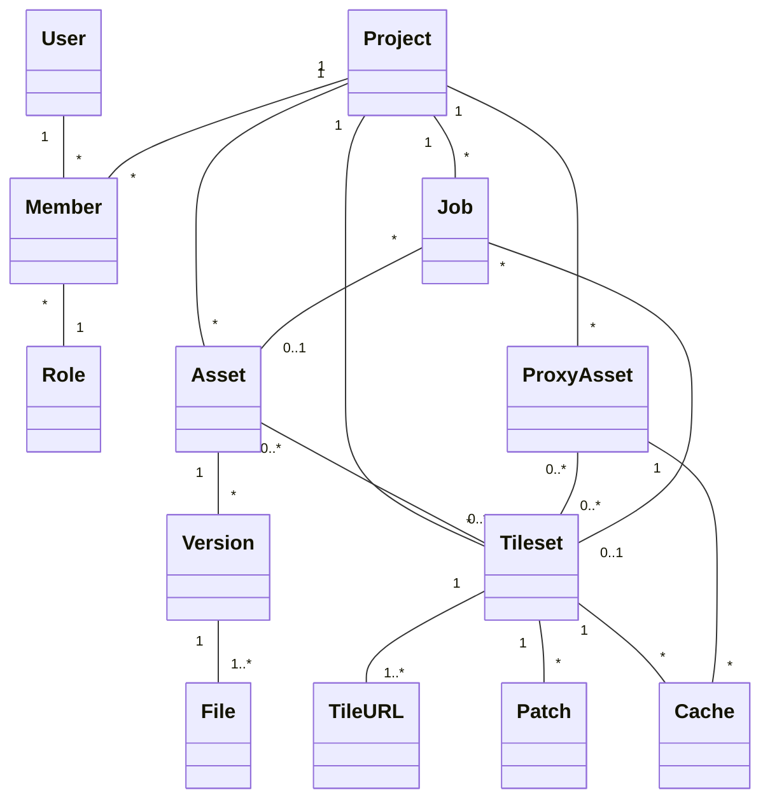

# Re:Earth Serve — Roadmap

> **Spatial Data Delivery Layer for the Re:Earth Ecosystem**
>
> Re:Earth Serve delivers processed spatial data under the correct security model, cleanly separating static file hosting (file-layer access control) from tile services (service-layer access control).

---

## Target Users

Based on the [product proposal](./PLAN.md), Re:Earth Serve targets two distinct user groups with tailored interfaces:

### Primary Segments

| Priority | Segment | Examples | Key Needs |
|----------|---------|----------|-----------|
| **Highest** | Government & municipal DX | PLATEAU projects, smart city initiatives, urban planning | Security accountability, procurement compliance, Re:Earth ecosystem integration |
| **High** | GIS SaaS & geospatial startups | Re:Earth Visualizer users, Mapbox alternative seekers | Cost efficiency, flexible integration, Japanese-language support |
| **Medium** | Enterprise (construction, infrastructure, real estate) | Large companies with internal spatial data delivery needs | Large-scale operations, security requirements, SLA |
| **Supplementary** | Research & academic institutions | Geospatial data sharing and publication | Low cost, open data integration |

### Two Interfaces: Web UI + CLI/API

Re:Earth Serve provides two parallel interfaces to serve both non-engineers and engineers:

| Interface | Target Users | Use Cases |
|-----------|-------------|-----------|
| **Web UI** | Non-engineers, GIS analysts, municipal staff, project managers | Asset management, tileset configuration, visual preview, project settings — no coding required |
| **CLI / API** | GIS engineers, plugin developers, CI/CD pipelines, AI agents | Automation, scripting, bulk operations, integration with Re:Earth Flow and external systems |

Both interfaces share the same underlying API. The Web UI is built on React Router (SSR) and will be developed after the API stabilizes (Phase 2+). The CLI is available from Phase 0.

---

## Architecture Overview

- **Runtime**: Cloudflare Workers
- **Object Storage**: Cloudflare R2 (egress-free)
- **Metadata Store**: Cloudflare KV
- **Containers** (future): Cloudflare Containers for GDAL / tippecanoe processing
- **Framework**: Hono (lightweight HTTP framework for Workers)

### Why Cloudflare?

| Advantage | Detail |
|-----------|--------|
| **Zero egress cost** | R2 has no bandwidth charges — potentially 100× cheaper than traditional cloud for tile delivery |
| **Edge computing** | Workers run in 300+ locations worldwide, minimizing latency |
| **Region hints** | R2 and Workers can be pinned to specific jurisdictions (data sovereignty) |
| **Integrated stack** | R2 + KV + Containers + Cron Triggers cover all infrastructure needs |

---

## Phase 0 — MVP: Ephemeral Asset Hosting (API + CLI)

Minimal viable file delivery service. No UI, no auth, no tile processing.

### Capabilities

- [x] **Upload**: `POST /assets` — upload a file (raw body streaming), receive a public URL
- [x] **Download**: `GET /files/:id/:filename` — serve the file with correct `Content-Type`, `Content-Encoding`, and `Range` request support (HTTP 206)
- [x] **Delete**: `DELETE /assets/:id` — remove an asset immediately
- [x] **Immutable assets**: once uploaded, an asset cannot be overwritten — upload or delete only
- [x] **Auto-expiration**: assets expire after 1 hour; a scheduled worker cleans up R2 objects
- [x] **CORS**: `Access-Control-Allow-Origin: *` on all asset responses
- [x] **CLI**: `reearth-serve <file>` uploads the file and prints the public URL
- [x] **Presigned URL upload**: `POST /assets/uploads` creates a presigned upload session; supports S3 multipart for large files (>100MB)
- [x] **Gzip compression**: compression is the uploader's responsibility — CLI compresses compressible files locally; server stores as-is and decompresses on download when needed

### Data Model (KV)

```
Key:   asset:{id}
Value: { id, filename, contentType, size, createdAt, expiresAt }
TTL:   3600s (auto-expire)
```

### API Summary

| Method | Path | Description |
|--------|------|-------------|
| `POST` | `/assets` | Upload a file (raw body streaming) |
| `GET` | `/assets/:id` | Get asset metadata |
| `DELETE` | `/assets/:id` | Delete an asset |
| `POST` | `/assets/uploads` | Create presigned upload session |
| `POST` | `/assets/uploads/:id/complete` | Complete upload session |
| `GET` | `/files/:id/:filename` | Download file (CORS `*`, Range support) |
| `GET` | `/health` | Health check |

---

## Phase 1 — Zip Upload & Static Site Hosting

Upload a `.zip` archive; the server extracts it and serves the contents as a directory.

- Zip extraction via Cloudflare Containers or in-worker decompression
- Directory listing or index file resolution (`index.html`)
- Enables uploading pre-built tile packages (XYZ directory structure, 3D Tiles tileset, etc.)

---

## Phase 2 — Authentication, Projects & Asset Management

Introduce user identity, project scoping, and persistent assets.

- **Auth**: API key or OAuth (Re:Earth Dashboard integration)
- **Projects**: logical grouping of assets with per-project settings
- **Asset settings**: public/private toggle, custom metadata, configurable TTL or permanent storage
- **Access control**: file-layer access control (URL visibility) — distinct from service-layer (Phase 3+)

---

## Phase 3 — On-Demand Tile Service

Create tile configurations that produce tile URLs with **zero conversion wait time** for supported formats.

### Phase 3.1 — Pre-tiled Sources

Serve existing tile data as-is:

- XYZ raster tiles (PNG / WebP / JPEG)
- MVT (Mapbox Vector Tiles)
- PMTiles (direct range-request serving)

### Phase 3.2 — COG (Cloud-Optimized GeoTIFF)

On-demand raster tile rendering from COG files:

- Tile-level range reads — no full-file download
- Automatic overview level selection based on zoom
- NoData → transparency handling

### Phase 3.3 — Single Image Tiling

On-demand tiling of single raster images:

- PNG / WebP / TIFF / GeoTIFF
- Geographic extent mapping to tile coordinates
- COG conversion via Cloudflare Containers (GDAL)

### Phase 3.4 — Multi-Source Compositing

Combine multiple tile sources into a single tileset via JSON configuration:

- Ordered source stack with per-source opacity and blend modes
- Parallel fetching of source tiles at request time
- Alpha compositing / blending (e.g., overlay satellite imagery with hillshade)
- Per-source zoom range and bounding box filters

```jsonc
{
  "sources": [
    { "type": "xyz", "url": "https://example.com/satellite/{z}/{x}/{y}.png", "opacity": 1.0 },
    { "type": "cog", "asset": "asset:abc123", "opacity": 0.5, "minZoom": 8 },
    { "type": "xyz", "url": "https://example.com/hillshade/{z}/{x}/{y}.png", "blend": "multiply" }
  ]
}
```

### Phase 3.5 — MapLibre Style JSON Rendering

Server-side raster tile rendering from MapLibre Style JSON definitions:

- Accept a [MapLibre Style Spec](https://maplibre.org/maplibre-style-spec/) JSON as tileset configuration
- Render vector tile sources into raster tiles on-the-fly
- Zero conversion wait — style changes take effect immediately
- Enables serving styled map tiles to clients that only support raster (e.g., CesiumJS, native apps)

### Phase 3.6 — External Service Proxy & Cache

Proxy and cache tiles from external tile services:

- **Proxy targets**: OpenStreetMap, Mapbox, Google Maps (2D/3D tiles), [Matterhorn](https://github.com/niccokunzmann/matterhorn) / other community tile servers, custom XYZ/TMS endpoints
- Request-level caching in R2 with configurable TTL
- Rate limiting and request coalescing to protect upstream services
- ETag / If-None-Match passthrough for efficient cache revalidation
- **License compliance**: per-proxy attribution metadata and terms-of-use acknowledgment required at configuration time

### Tile Service Data Model

```
Tileset → has many Sources (ordered, blendable)
Source  → XYZ URL | R2 COG | R2 GeoTIFF | uploaded asset
       | external proxy | MapLibre style
```

Each tileset produces a TileJSON endpoint and `/{z}/{x}/{y}.{format}` URL.

---

## Phase 4 — Terrain Tiles (Ellipsoidal Height)

Terrain tile delivery with geoid–ellipsoid height composition:

- Serve Cesium Terrain / Quantized Mesh tiles
- Combine elevation data with geoid models (e.g., Japan GSI geoid) to produce ellipsoidal height tiles on-the-fly
- Critical for 3D WebGIS (CesiumJS, deck.gl) — only Cesium ion offers this today
- Supports Japan-specific geoid data for PLATEAU use cases

---

## Phase 5 — Vector Tile Generation

Upload raw vector data; the system converts it into MVT tiles:

- Input formats: GeoJSON, GeoPackage, Shapefile, CSV with coordinates
- Conversion via tippecanoe (Cloudflare Containers)
- Async processing with status polling
- Output: MVT tileset with TileJSON metadata

---

## Phase 6 — Vector Tile Partial Updates (Lightning-style)

Incremental vector tile updates without full re-tiling:

- Upload a GeoJSON diff / patch
- Store diffs separately; merge with base tiles on read
- Background compaction: periodically re-tile to fold diffs into base tiles
- Inspired by [Felt Lightning](https://felt.com/blog/lightning-vector-tiles) architecture

---

## Phase 7 — 3D Tiles Generation

Upload 3D model and city model data; the system converts them into streamable 3D Tiles:

- **Input formats**: glTF / GLB, CityGML, IFC, OBJ, FBX, LAS / LAZ (point clouds)
- Conversion pipeline via Cloudflare Containers (e.g., py3dtiles, citygml-tools, FME bridge)
- Async processing with progress tracking and status polling
- Output: 3D Tiles 1.1 tileset (tileset.json + .glb / .b3dm / .pnts)
- Spatial indexing and LOD (Level of Detail) generation
- Critical for PLATEAU workflow: CityGML → 3D Tiles end-to-end within Re:Earth ecosystem

---

## Phase 8 — Enterprise Features

Production hardening and monetization infrastructure:

- **Asset versioning**: full Version support — upload new content as a new Version, rollback to previous Versions, version diffing
- **Access & audit logs**: per-asset, per-tile request logging
- **Usage metering**: storage size, transfer volume, request counts — for billing integration
- **Data residency**: paid plan option to pin R2 storage to a specific country/region
- **SLA tiers**: uptime guarantees for enterprise customers
- **ISMAP consideration**: for Japanese government procurement, a non-Cloudflare deployment path may be required (Workers are not yet ISMAP-listed)

---

## Design Principles

1. **Two-layer security model**: file-layer (URL/storage permissions) and service-layer (token-based authorization) are architecturally separated — never conflated.
2. **Cloudflare-native**: leverage R2, KV, Workers, Containers, and Cron Triggers — no external infrastructure dependencies.
3. **Zero-wait tile delivery**: wherever possible, serve tiles on-demand without pre-processing (COG, pre-tiled archives, height composition).
4. **Immutable assets**: files are write-once. Updates create new assets; old ones are deleted.
5. **Re:Earth ecosystem integration**: designed as the delivery layer between Flow (processing) and Visualizer (display).

---

## References

- [Re:Earth Serve Product Proposal](./PLAN.md)
- [untiled](https://github.com/eukarya-inc/untiled) — tile server prototype (architecture reference)
- [stralift](https://github.com/eukarya-inc/stralift) — tile processing library
- [Felt Lightning](https://felt.com/blog/lightning-vector-tiles) — incremental vector tile architecture

---

## Domain Model



## Glossary

| Term | Description |
|------|-------------|
| **User** | An authenticated identity. Account management and authentication are handled by external infrastructure (Re:Earth account platform / Cerbos for authorization). In Phase 0 (MVP), a simplified auth workaround is used. |
| **Member** | The association between a User and a Project, carrying a Role. A User can be a Member of multiple Projects. |
| **Role** | A permission level assigned to a Member within a Project (e.g., owner, editor, viewer). Follows Re:Earth conventions. |
| **Project** | A top-level container that groups Assets, Proxy Assets, Tilesets, and their configuration. All resources are scoped to a Project. |
| **Asset** | The unit of upload. Represents one uploaded object (a single file or a zip archive). Carries metadata such as public/private visibility, content type, and expiration policy. An Asset holds one or more Versions. |
| **Version** | A point-in-time snapshot of an Asset's content. Each Version is immutable — uploading new content creates a new Version rather than overwriting. The Asset always has a "current" Version that is served by default. Not implemented in MVP, where each Asset implicitly has exactly one Version. |
| **File** | An individual file belonging to a Version. A single-file upload produces one File. A zip upload produces many Files (the extracted contents). Files are addressable by path within their Version. |
| **Proxy Asset** | A virtual asset backed by an external URL (e.g., a third-party tile service). The system proxies requests to the upstream source and caches responses in R2. Behaves like an Asset from the Tileset's perspective, but has no uploaded Files. |
| **Job** | Tracks the status of an asynchronous background operation (e.g., zip extraction, COG conversion, vector tile generation, 3D Tiles conversion). Automatically created when a triggering event occurs. May be associated with an Asset (e.g., zip extraction) or a Tileset (e.g., vector tile compaction, 3D Tiles generation). Does **not** cover on-demand tile computation — only offline / batch processing. |
| **Tileset** | A tile delivery configuration that references one or more Assets and/or Proxy Assets, along with rendering parameters (source stack order, blend modes, zoom ranges, style JSON, etc.). Defining a Tileset produces one or more Tile URLs. *Name candidates: Tileset / TileEndpoint / TileRecipe — open for discussion.* |
| **Tile URL** | A concrete endpoint URL produced by a Tileset (e.g., `/{z}/{x}/{y}.png`, `/{z}/{x}/{y}.mvt`). A single Tileset may expose multiple Tile URLs for different output formats. Each Tile URL also has a corresponding TileJSON metadata endpoint. |
| **Patch** | An incremental update to a Tileset's vector tile data (Phase 6). Stores a GeoJSON diff that is merged with base tiles at read time. Multiple Patches can accumulate; background compaction Jobs periodically fold them into the base tile data and remove consumed Patches. |
| **Cache** | Pre-computed tile images stored in R2, keyed by tileset + coordinates + source configuration hash. Associated with a Tileset (computed tiles) or a Proxy Asset (cached upstream responses). Automatically invalidated when the configuration changes. Supports partial purge (by zoom range, bounding box, or individual tile). Also stores merge artifacts for vector tile partial updates (Phase 6). |

---

## CLI Design

> **CLI binary name is TBD.** `reearth-serve` is too long for frequent use; `serve` conflicts with an existing npm package. Needs a short, memorable name. Candidates welcome.

### Principles

- **Simple and memorable**: minimal subcommands, consistent patterns, easy to learn in minutes.
- **AI-friendly**: structured output (`--json`), predictable command grammar, and rich `--help` / error messages with actionable hints — so both humans and LLM-based agents (Claude Code, Copilot CLI, etc.) can operate it fluently.
- **Entity-oriented grammar**: `<cli> <entity> <verb> [args...] [flags...]` — mirrors the domain model directly.
- **Inspired by**: [GitHub CLI (`gh`)](https://cli.github.com/), [Skills CLI](https://github.com/anthropics/skills), [AWS CLI (`aws s3`)](https://docs.aws.amazon.com/cli/latest/reference/s3/), [Google Cloud CLI (`gsutil`)](https://cloud.google.com/storage/docs/gsutil) — proven patterns for AI-operable and file-operable CLIs.

### Authentication & Demo Mode

```bash
# Log in (opens browser or accepts token)
<cli> login

# Upload without logging in → demo mode (ephemeral, 1-hour TTL, no project)
<cli> upload myfile.geojson
# → https://serve.reearth.io/d/abc123/myfile.geojson  (expires in 1 hour)
```

- `login` stores credentials locally (`~/.config/reearth-serve/`).
- Without login, all commands that require a project will prompt or fail with a helpful hint.
- Demo mode assets are anonymous, public, and auto-expire — useful for quick sharing and sales demos.

### Command Structure

```bash
<cli> <entity> <verb> [args...] [flags...]
```

#### Core Commands

| Command | Description |
|---------|-------------|
| `<cli> login` | Authenticate (browser OAuth or `--token`) |
| `<cli> logout` | Clear stored credentials |
| `<cli> whoami` | Show current user and default project |
| `<cli> upload <file>` | Quick upload — shortcut for `asset create` (demo mode if not logged in) |

#### Entity Commands

| Command | Description |
|---------|-------------|
| **project** | |
| `<cli> project list` | List projects |
| `<cli> project show [id]` | Show project details |
| `<cli> project create <name>` | Create a project |
| `<cli> project delete <id>` | Delete a project |
| `<cli> project use <id>` | Set default project for subsequent commands |
| **asset** | |
| `<cli> asset list` | List assets in current project |
| `<cli> asset show <id>` | Show asset metadata and file list |
| `<cli> asset create <file\|url>` | Upload a file or zip archive |
| `<cli> asset delete <id>` | Delete an asset |
| **tileset** | |
| `<cli> tileset list` | List tilesets |
| `<cli> tileset show <id>` | Show tileset config and tile URLs |
| `<cli> tileset create --config <json>` | Create a tileset from JSON config |
| `<cli> tileset update <id> --config <json>` | Update tileset configuration |
| `<cli> tileset delete <id>` | Delete a tileset |
| `<cli> tileset preview <id>` | Open tile preview in browser |
| **job** | |
| `<cli> job list` | List recent jobs |
| `<cli> job show <id>` | Show job status and progress |
| `<cli> job wait <id>` | Block until job completes (useful in scripts) |
| **cache** | |
| `<cli> cache purge <tileset-id>` | Purge all cached tiles for a tileset |
| `<cli> cache purge <tileset-id> --bbox <w,s,e,n>` | Purge by bounding box |
| `<cli> cache purge <tileset-id> --zoom <min-max>` | Purge by zoom range |

#### File Commands (à la `aws s3` / `gsutil`)

Operate on asset contents using familiar filesystem-style commands. Asset paths use the scheme `serve://<project>/<asset>/[path...]`.

| Command | Description |
|---------|-------------|
| `<cli> ls <asset-id>` | List files in an asset (like `ls`) |
| `<cli> ls serve://my-project/` | List all assets in a project |
| `<cli> cp <asset-path> <local>` | Download file(s) from an asset to local |
| `<cli> sync <asset-path> <local-dir>` | One-way sync asset → local directory (like `rsync`, download only) |
| `<cli> cat <asset-path>` | Print file contents to stdout |

```bash
# List files inside a zip-uploaded asset
<cli> ls abc123
# tileset.json
# tiles/0/0/0.pbf
# tiles/1/0/0.pbf
# tiles/1/1/0.pbf

# Download a specific file
<cli> cp serve://my-project/abc123/tileset.json ./local/

# Download entire asset contents
<cli> cp -r serve://my-project/abc123/ ./local-dir/

# Sync asset contents to local directory
<cli> sync serve://my-project/abc123/ ./local-dir/

# Pipe a file to another tool
<cli> cat serve://my-project/abc123/metadata.json | jq '.bounds'
```

### Output Modes

```bash
# Human-readable (default)
<cli> asset list

# JSON output for scripting and AI agents
<cli> asset list --json

# Quiet — print only IDs or URLs (for piping)
<cli> asset create myfile.tif --quiet
# → https://serve.reearth.io/p/proj1/a/xyz123/myfile.tif
```

### Error Messages

Errors include a short explanation and a suggested next step:

```
Error: Not logged in. Demo mode only supports `upload`.
Hint:  Run `<cli> login` to access project commands.
```

```
Error: Asset "abc123" not found in project "my-project".
Hint:  Run `<cli> asset list` to see available assets.
```
